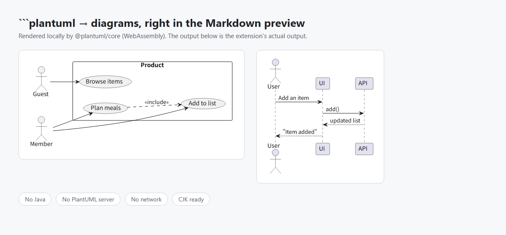

# PlantUML Local

[](https://opensource.org/licenses/MIT)
[](https://github.com/kkdev92/plantuml-local/actions/workflows/ci.yml)
[](https://marketplace.visualstudio.com/items?itemName=kkdev92.plantuml-local)
[](https://www.typescriptlang.org/)

Render ```` ```plantuml ```` code blocks in the built-in Markdown preview — no Java, no server, no network connection.
Your diagram source is processed locally and is not sent to a rendering service.
*Built for design docs you can't send anywhere — write, preview, done.*

> **Status:** Active (best-effort maintenance)



---

## Table of Contents

- [Features](#features)
- [Installation](#installation)
- [Quick Start](#quick-start)
- [Why PlantUML Local](#why-plantuml-local)
- [Usage](#usage)
- [Known Limitations](#known-limitations)
- [Configuration](#configuration)
- [How It Works](#how-it-works)
- [Security and Privacy](#security-and-privacy)
- [Platform Requirements](#platform-requirements)
- [Troubleshooting](#troubleshooting)
- [Contributing](#contributing)
- [Support & Maintenance Policy](#support--maintenance-policy)
- [License](#license)
- [Acknowledgments](#acknowledgments)

---

## Features

- **Built-in Preview**: Diagrams appear in the same Markdown preview you already use (`Ctrl+Shift+V`)
- **Offline Rendering**: No Java, no PlantUML server, no network connection required — nothing to install besides the extension
- **Fault-Tolerant**: A syntax error shows up inline at the broken diagram; the rest of the page stays intact
- **Multi-Diagram Pages**: Any number of diagrams per page; renders are serialised so results never mix
- **Dark-Mode Aware**: Diagrams re-render to match your colour theme, or pin the palette via settings
- **Full-Width Text Support**: Japanese and other full-width characters are measured and laid out correctly
- **Non-Intrusive**: All other fenced code blocks (` ```js `, ` ```mermaid `, …) are left untouched
- **Local by Design**: Rendering is isolated in a worker thread; only sanitised SVG reaches the preview

---

## Installation

### Install from VS Code Marketplace (recommended)

- Open the Extensions view (`Ctrl+Shift+X`)
- Search for **PlantUML Local**
- Click **Install**

You can also open the Marketplace page directly:

- <https://marketplace.visualstudio.com/items?itemName=kkdev92.plantuml-local>

### Build from Source (for contributors)

> If you just want to use PlantUML Local, installing from the Marketplace is the easiest option.

```bash
git clone https://github.com/kkdev92/plantuml-local.git
cd plantuml-local
npm install
npm run install-local
```

---

## Quick Start

1. Open any Markdown file
2. Add a fenced code block with the `plantuml` language:

   ````markdown
   ```plantuml
   @startuml
   Alice -> Bob : Hello
   @enduml
   ```
   ````

3. Open the preview (`Ctrl+Shift+V`)
4. The block renders as a diagram — edit and save, and it follows

See [sample.md](sample.md) for a tour of diagram types, including error handling.

---

## Why PlantUML Local

Previewing PlantUML in VS Code usually means one of two things: installing a Java
runtime to run `plantuml.jar` locally, or handing your diagram source to a
PlantUML server. The server route is often the public one at `plantuml.com`,
which means the source of every diagram is encoded into a URL and sent out on
each preview — not always acceptable for confidential or internal design
documents.

PlantUML Local takes a third route: it renders ```` ```plantuml ```` blocks on
your own machine and inserts the resulting SVG into VS Code's built-in Markdown
preview.

- No Java runtime
- No PlantUML server
- No separate preview panel
- No network connection required to render

The extension bundles the official
[`@plantuml/core`](https://www.npmjs.com/package/@plantuml/core) JavaScript
build of PlantUML; Graphviz layout is provided locally by Viz.js compiled to
WebAssembly.

---

## Usage

PlantUML Local renders most diagram types available in the bundled PlantUML
browser engine, including sequence, use-case, class, state, activity and
component diagrams.

The first render after startup is the slow one — around 0.4 s on a typical
development machine while the WebAssembly engine initialises. Later renders are
considerably faster, though timings depend on the machine and on how complex the
diagram is.

If a diagram looks stale, run `PlantUML Local: Clear Render Cache and Re-render`
from the Command Palette.

---

## Known Limitations

- `!include` is not supported: URL-based directives are rejected with an inline
  message, and local-file includes are not available in the bundled browser
  build of the engine
- Remote themes, images and other network resources are not supported
- Optional external sprite libraries are not bundled
- Features excluded from the bundled PlantUML browser build are unavailable
- Text is measured with approximate metrics (Node has no Canvas), so element
  widths, line wrapping and placement can differ slightly from plantuml.com
- A render that exceeds 30 seconds is terminated

---

## Configuration

| Setting | Default | Description |
| --- | --- | --- |
| `plantumlLocal.theme` | `auto` | Diagram palette. `auto` follows the VS Code theme; `light` / `dark` pin it |
| `plantumlLocal.logLevel` | `info` | Log level for the *PlantUML Local* output channel |

---

## How It Works

Rendering inside the preview webview — the way Mermaid extensions work — is not
an option for PlantUML: use-case, class and state layouts come from Graphviz,
which ships as WebAssembly, and the preview's Content-Security-Policy does not
grant `wasm-unsafe-eval`.

So the engine runs in a **worker thread on the extension host** (no CSP there),
and only the finished, sanitised SVG is injected into the preview. PlantUML
Local contributes no scripts to the Markdown preview — the sanitised SVG is the
only thing it adds to the rendered document.

markdown-it's `fence` rule is synchronous while rendering is not; they meet
through a cache: the first pass shows a placeholder and starts rendering,
completion triggers one debounced preview refresh, and the second pass serves
the SVG from cache.

---

## Security and Privacy

PlantUML Local is designed to render diagrams without sending their source to an
external rendering service.

- **Local Rendering**: The engine, the Graphviz WebAssembly and all runtime assets ship inside the VSIX and load from disk
- **No Telemetry**: The extension collects no usage data and makes no intentional network requests
- **Network Guard**: `fetch` / `XMLHttpRequest` / `WebSocket` / `EventSource` are replaced with throwing stubs inside the render worker — a network attempt fails the render instead of making a request
- **Remote References Rejected**: `!include https://…` / `!theme … from https://…` render an explanatory message instead of reaching the engine
- **Worker Isolation**: The engine's browser shims live in a worker thread, never on the extension host globals
- **Render Timeout**: A render exceeding 30 s is abandoned; the worker is terminated and restarted
- **SVG Sanitisation**: Scripts, event handlers and non-fragment links are stripped before SVG reaches the preview
- **Untrusted Workspaces Supported**: No workspace files are read, no processes are spawned

These controls reduce the extension's attack surface, but they have limits worth
being explicit about: a worker thread is an isolation boundary for globals, not a
process- or OS-level security sandbox, and stubbing browser-style network APIs is
not the same as closing every network path available to Node.js.

CI verifies each package: `verify-vsix` unpacks the VSIX, checks for leaked key
material and rendering-service URLs, and renders a diagram from the packaged
worker.

For the full threat model and for vulnerability reporting, see
[SECURITY.md](SECURITY.md).

---

## Platform Requirements

- VS Code 1.96 or later
- Windows, macOS or Linux, on x64 or ARM64

That's it — no Java runtime, no Graphviz install, no external tools.

CI runs the test suite on Windows, macOS and Linux (x64 on Windows and Linux,
ARM64 on macOS). The extension is plain JavaScript and WebAssembly, so other
combinations are expected to work; please open an issue if one does not.

---

## Troubleshooting

- **Stuck on "Rendering diagram…"**: Check *Output → PlantUML Local* for worker errors, then run `PlantUML Local: Clear Render Cache and Re-render`
- **A red syntax-error box appears**: The message comes from the PlantUML engine — only that diagram is affected, and the rest of the page still renders
- **Colours look wrong after switching themes**: Backgrounds follow the palette the diagram was *rendered* with. If you pinned `plantumlLocal.theme`, that palette wins by design
- **Layout differs from plantuml.com**: Text is measured with approximate metrics in the Node renderer, so box widths, line wrapping and element placement can differ slightly

---

## Contributing

Contributions are welcome — thank you for helping make PlantUML Local better 🙌
Please see [CONTRIBUTING.md](CONTRIBUTING.md) for guidelines.

If you're planning a larger change, opening an issue first is appreciated (it helps align direction and avoids duplicate work). Note that features requiring Java, a server or network access are out of scope by design.

---

## Support & Maintenance Policy

PlantUML Local is a personal hobby project maintained in spare time.
The project is active, but support is best-effort: I'll do my best to review issues and PRs, and releases may be a bit slow sometimes — thank you for your patience.

Helpful things when reporting bugs:

- OS / architecture / VS Code version
- The smallest PlantUML source that reproduces the issue
- Output from *Output → PlantUML Local* at `logLevel: debug`

Security-related reports should follow [SECURITY.md](SECURITY.md).
Really appreciate you using PlantUML Local 💛

---

## License

PlantUML Local is licensed under the MIT License — see [LICENSE](LICENSE).

The bundled engine `@plantuml/core` is MIT-licensed from version 1.2026.6 onwards (earlier versions are GPL-3.0-or-later). This extension therefore depends on `^1.2026.6`, which permits any compatible 1.x release from that version up; the exact version a build used is recorded in `package-lock.json`.

Copyright and licence notices for the third-party code shipped inside the VSIX are collected in [THIRD_PARTY_NOTICES.md](THIRD_PARTY_NOTICES.md).

---

## Acknowledgments

- Diagram rendering powered by [PlantUML](https://plantuml.com/) and its [`@plantuml/core`](https://www.npmjs.com/package/@plantuml/core) TeaVM build — this extension is a third-party project, not affiliated with or endorsed by the PlantUML project
- Graphviz layout by [Viz.js](https://github.com/mdaines/viz-js), a WebAssembly build of Graphviz shipped inside `@plantuml/core`
- DOM for the engine by [happy-dom](https://github.com/capricorn86/happy-dom)
- Extension utilities by [@kkdev92/vscode-ext-kit](https://github.com/kkdev92/vscode-ext-kit)
