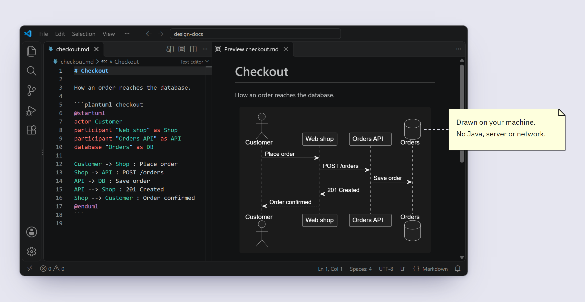
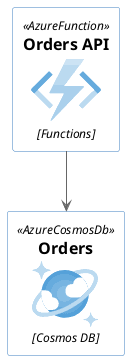
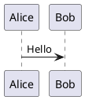

# PlantUML Local

[](https://opensource.org/licenses/MIT)
[](https://github.com/kkdev92/plantuml-local/actions/workflows/ci.yml)
[](https://marketplace.visualstudio.com/items?itemName=kkdev92.plantuml-local)
[](https://www.typescriptlang.org/)
[](https://www.bestpractices.dev/projects/14052)

Render ```` ```plantuml ```` code blocks in the built-in Markdown preview — no Java, no server, no network connection.
Your diagram source is processed locally and is not sent to a rendering service.
*Built for design docs you can't send anywhere — write, preview, done.*

> **Status:** Active (best-effort maintenance)



---

## Table of Contents

- [Features](#features)
- [Installation](#installation)
- [Quick Start](#quick-start)
- [Why PlantUML Local](#why-plantuml-local)
- [Usage](#usage)
- [Known Limitations](#known-limitations)
- [Configuration](#configuration)
- [How It Works](#how-it-works)
- [Security and Privacy](#security-and-privacy)
- [Platform Requirements](#platform-requirements)
- [Troubleshooting](#troubleshooting)
- [Contributing](#contributing)
- [Support & Maintenance Policy](#support--maintenance-policy)
- [License](#license)
- [Acknowledgments](#acknowledgments)

---

## Features

- **Built-in Preview**: Diagrams appear in the same Markdown preview you already use
- **Syntax Highlighting**: ```` ```plantuml ```` blocks and `.puml` files are coloured in the editor, following the syntax the bundled engine accepts
- **Offline Rendering**: No Java, no PlantUML server, no network connection required — nothing to install besides the extension
- **Fault-Tolerant**: A syntax error shows up inline at the broken diagram; the rest of the page stays intact
- **Problems Panel**: Errors, warnings and unsupported syntax in the diagrams of open Markdown files are listed with their line, preview or not
- **Multi-Diagram Pages**: Any number of diagrams per page; renders are serialised so results never mix
- **Dark-Mode Aware**: Diagrams re-render to match your colour theme, or pin the palette via settings
- **Full-Width Text Support**: Japanese and other full-width characters are measured and laid out correctly
- **Non-Intrusive**: All other fenced code blocks (` ```js `, ` ```mermaid `, …) are left untouched
- **Local by Design**: Rendering is isolated in a worker thread; only sanitised SVG reaches the preview

---

## Installation

### Install from VS Code Marketplace (recommended)

- Open the Extensions view (`Ctrl+Shift+X`)
- Search for **PlantUML Local**
- Click **Install**

You can also open the Marketplace page directly:

- <https://marketplace.visualstudio.com/items?itemName=kkdev92.plantuml-local>

### Build from Source (for contributors)

> If you just want to use PlantUML Local, installing from the Marketplace is the easiest option.

```bash
git clone https://github.com/kkdev92/plantuml-local.git
cd plantuml-local
npm install
npm run install-local
```

---

## Quick Start

1. Open any Markdown file
2. Add a fenced code block with the `plantuml` language (`puml` works too):

   ````markdown
   ```plantuml
   @startuml
   Alice -> Bob : Hello
   @enduml
   ```
   ````

3. Open the preview: the preview button at the top right of the editor, or **Markdown: Open Preview** (`Ctrl+Shift+V` by default)
4. The block renders as a diagram — edit and save, and it follows

See [sample.md](sample.md) for a tour of diagram types, including error handling.

---

## Why PlantUML Local

Previewing PlantUML in VS Code usually means one of two things: installing a Java
runtime to run `plantuml.jar` locally, or handing your diagram source to a
PlantUML server. The server route is often the public one at `plantuml.com`,
which means the source of every diagram is encoded into a URL and sent out on
each preview — not always acceptable for confidential or internal design
documents.

PlantUML Local takes a third route: it renders ```` ```plantuml ```` blocks on
your own machine and inserts the resulting SVG into VS Code's built-in Markdown
preview.

- No Java runtime
- No PlantUML server
- No separate preview panel
- No network connection required to render

The extension bundles the official
[`@plantuml/core`](https://www.npmjs.com/package/@plantuml/core) JavaScript
build of PlantUML; Graphviz layout is provided locally by Viz.js compiled to
WebAssembly.

---

## Usage

PlantUML Local renders most diagram types available in the bundled PlantUML
browser engine, including sequence, use-case, class, state, activity and
component diagrams.

The first render after startup is the slow one — around 0.4 s on a typical
development machine while the WebAssembly engine initialises. Later renders are
considerably faster, though timings depend on the machine and on how complex the
diagram is.

If a diagram looks stale, run `PlantUML Local: Clear Render Cache and Re-render`
from the Command Palette.

A diagram whose `@enduml` line is missing is drawn as if the block ended with
one, with a note above it saying so; the export writes it the same way.

### Syntax highlighting

` ```plantuml ` and ` ```puml ` blocks are also coloured in the editor, including
ones inside block quotes and list items. As with the preview, only these two
languages count, exactly — ` ```PlantUML ` and ` ```uml ` stay plain. The grammar follows the parser of
the bundled engine rather than PlantUML's documentation, and covers every
diagram type that engine renders:

- the JSON and YAML inside `@startjson` / `@startyaml` are coloured by VS
  Code's own JSON and YAML grammars
- diagram types the bundled engine does not render (`@startditaa`, …) are
  marked invalid
- some older forms the engine accepts only with a warning — a colour in front
  of an activity (`#pink:text`), `label on first column` in a Gantt chart — are
  marked deprecated

Tokens carry the usual TextMate scope names with a `.plantuml` suffix
(`keyword.other.plantuml`, `entity.name.type.plantuml`, …), so any colour
theme applies, and `editor.tokenColorCustomizations` can adjust them.

Files ending in `.puml`, `.plantuml`, `.pu`, `.iuml` or `.wsd` open as the
language PlantUML, with the same colouring. *Toggle Line Comment* uses `'` and
*Toggle Block Comment* uses `/' … '/`. A `.puml` file has a preview of its own
(below), and its diagrams can be exported to SVG.

### Previewing `.puml` files

*PlantUML Local: Open Diagram Preview to the Side* — the preview button in the
title bar of a `.puml` file's editor — opens a panel showing the diagram under
the cursor. The panel stays with that file while the focus moves elsewhere,
lists the file's diagrams when it holds several, and draws the diagram again as
the file changes. Running the command again in the same file brings its panel
back rather than opening another. *Open Diagram Preview* does the same in the
editor's own group (or hold Alt on the button). A panel left open comes back
when VS Code restarts, on the same diagram when that diagram has a name, and
otherwise asking which one to show.

The diagram is first fitted to the panel, never past 100% — the size the
diagram gives itself, which PlantUML's `scale` sets. The buttons above it zoom
out and in, fit it, and show it at 100%; so do the keys `-`, `+`, `0` and `1`.
Ctrl+wheel (Cmd on macOS) or a pinch zooms at the pointer, the wheel scrolls,
dragging moves the diagram, and the arrow keys move it by 40 pixels (200 with
Shift). Each diagram keeps its zoom and position while it is redrawn, while
the panel is hidden, and across a restart.

The panel shows the SVG as an image, so nothing in it can run, and loads
nothing but its own script and stylesheet.

### Completion

In a diagram — a ` ```plantuml ` block or a `.puml` file — suggestions open on:

- `@` at the start of a line: the start line of each diagram type the bundled
  engine draws, or inside a diagram, its end line
- `!` at the start of a line: the preprocessor directives, without the ones
  the engine does not act on, such as `!includesub`
- `!theme `: the themes that ship with the extension
- `<&`: the names of the OpenIconic icons

Where a diagram can start, `puml-` offers a template of a sequence, class,
activity, state, component or use case diagram, with its names to tab through:
a whole ` ```plantuml ` block in the text of a Markdown file, the bare diagram
in an empty block or between the diagrams of a `.puml` file.

Markdown turns quick suggestions off, so in a Markdown file the list opens on
those characters, or with *Trigger Suggest* (`Ctrl+Space`) — type `puml` and
press it for the templates.

### Problems

The diagrams of open Markdown files are checked, whether or not a preview is
open, and what is wrong with them is listed in the Problems panel on the line
it is on:

- the engine's errors and warnings;
- what the bundled engine cannot do: including a file, a library other than
  `azure`, a theme from a folder, a URL, emoji;
- what it would drop without a word: a second diagram in a block, the pages
  after `newpage`, an `!includesub`;
- a diagram with no `@enduml` line, which is drawn anyway.

The engine stops at the first error, so a diagram shows at most one, and it
names a line but no column, so the whole line is marked. Its warnings name no
line at all and are put on the diagram's `@startuml` line. A document is checked
again half a second after it last changed, and its problems disappear as soon as
it changes. `plantumlLocal.diagnostics.enabled` turns the checks off.

### Icons and sprites

Sprites render, including the Azure icon set, which ships inside the extension:

````markdown

```plantuml
@startuml
!include <azure/AzureCommon>
!include <azure/Compute/AzureFunction>
!include <azure/Databases/AzureCosmosDb>

AzureFunction(fn, "Orders API", "Functions")
AzureCosmosDb(db, "Orders", "Cosmos DB")
fn --> db
@enduml
```
````

The library is [Azure-PlantUML](https://github.com/plantuml-stdlib/Azure-PlantUML)
and the include paths are its own, so existing diagrams work unchanged — and,
as everywhere else here, nothing is downloaded to render them. Sprites written
directly into the diagram with `sprite $name […] { … }` work too.

Azure is the only icon set bundled. The AWS and GCP libraries both place their
icons under CC-BY-ND 2.0 with only the macros under MIT, and this extension
ships nothing but MIT / BSD / EPL; Azure-PlantUML has no such split. Other
`!include <…>` libraries report that they are unavailable rather than being
fetched — but their sprite definitions can be pasted into the diagram, which
renders identically.

PlantUML's own icons and themes ship as well: the OpenIconic icons creole draws
with `<&check>`, and the `!theme` library (`!theme cerulean`) — all of it but
four themes, `mars`, `toy` and `vibrant` (Apache License 2.0) and `sunlust`
(GPL 3+), for which the engine reports that it cannot load the theme. Emoji
(`<:smile:>`) do not ship: their images, from Twemoji, are under CC-BY 4.0, so
a diagram using one shows a message saying emoji are not supported.

### Exporting for GitHub and other hosts

The preview is the only place a ` ```plantuml ` block becomes a diagram — GitHub
renders one as source, not as a picture. To be readable there too, export the
SVG and reference it. One command does both. Name the block:

````markdown

```plantuml orders-api
@startuml
Alice -> Bob : Hello
@enduml
```
````

*Export All Diagrams and Update References* then writes
`images/orders-api.svg` and, directly below the block, a Markdown image
reference whose target is `images/orders-api.svg#plantuml-local`.

| Command | What it does |
| --- | --- |
| `PlantUML Local: Export Diagram as SVG` | Writes the block under the cursor, or the only block in the file |
| `PlantUML Local: Export All Diagrams as SVG` | Writes every **named** block in the file |
| `PlantUML Local: Export All Diagrams and Update References` | The above, then inserts or updates the image line after each block |

All three are also in the editor's right-click menu: the single export appears
with the cursor inside a block, the other two whenever the file contains a
diagram — so the menu of an ordinary Markdown file stays untouched. Run from
the command palette while the preview has focus, they use the only open
Markdown document, or ask which one when several are open.

The word after the language — `orders-api` above — names the output file. It is
what ties a block to its SVG across edits, which a position could not: inserting
a diagram above would silently repoint everything below it. Naming is therefore
required for the bulk commands, and the single-diagram one asks when the block
has none — or when its name could not be a file name, since names are limited
to 128 letters, digits, hyphens and underscores. The bulk commands report such
a block as failed.

The first two commands also work in a `.puml` file, which writes each of its
diagrams to a file of its own. A diagram is named by an id on its start line,
`@startuml(id=orders-api)`; a file holding a single diagram may leave it out,
and the diagram is named after the file. References are inserted into Markdown
only.

A file already at the target is replaced only when you say so. If it holds the
diagram already, nothing is written; if it holds something else — a file put
there by hand, or another block's export — the command asks first, once for all
the files it would replace, and the bulk commands can keep those files and
write the rest. Each file is written under a temporary name beside the target
and then renamed over it, so an export that fails part way never leaves half an
image behind.

The `#plantuml-local` fragment on the inserted reference does two jobs. GitHub
ignores it and renders the SVG, while this extension's preview hides marked
images — the block above them already renders, and without that the same
diagram would appear twice (`plantumlLocal.hideExportedImages` turns this off,
for checking how the exported file itself looks). It also marks the line as
machine-managed: renaming a block or changing the export directory rewrites the
line on the next run, while every line without the marker — including a
hand-written reference to the same file — is never touched. The update command
is idempotent: running it twice changes nothing, and one Undo reverts whatever
it wrote. A block inside a block quote or a list item gets its reference inside
the same quote or item. If the document changes while the export runs, the files
are written but the references are left alone; run the command again.

Exports use the light palette regardless of your editor theme, since the files
face hosts whose background this extension does not control;
`plantumlLocal.exportTheme` pins `dark` or follows the preview instead. Each
exported SVG also carries an opaque background of its palette — the engine
leaves the canvas transparent, and a dark host page would otherwise show
through it.

Exported SVGs do not carry the diagram source. PlantUML embeds it in every SVG
it draws, so that an image can be decoded back into a diagram — comments,
preprocessor variables and hidden elements included, none of which the picture
shows — and the engine bundled here has no option to leave it out (PlantUML's
command line has `-nometadata`). The extension removes it, together with the
element names the engine records in `data-*` attributes. Keep the Markdown as
the source of a diagram: an exported file cannot be turned back into one.

A block that does not render is reported rather than exported. PlantUML
answers a syntax error, an include it cannot resolve or an empty diagram with
a drawing of the error in place of the diagram; instead of saving that as the
block's SVG, the export commands count the block as failed and show PlantUML's
message with the line of the document it points to. No file or reference is
written for it.

`plantumlLocal.exportDirectory` (default `images`) decides where files go,
relative to the Markdown file rather than to the workspace root, so moving a
document keeps its diagrams beside it. Exporting writes files, so it needs a
trusted workspace — the preview does not.

Two things to keep in mind. The SVG is a snapshot: after editing a block,
re-run the command (commit the `images/` directory alongside the document,
or the references point at nothing). And this flow is for hosts that do
*not* render PlantUML — one that does, like GitLab, renders the block itself
and would show the referenced image as a second copy.

---

## Known Limitations

- Only the `azure` standard-library entry is bundled; other `!include <…>`
  libraries are unavailable
- `!include` of a URL or of a file is not supported: URL-based directives are
  rejected with an inline message, and file includes are not available in the
  bundled browser build of the engine
- Remote themes and other network resources are not supported
- Images (``) are not loaded, local or remote: the engine draws an
  `[img TBD…]` placeholder in their place
- Emoji (`<:smile:>`) are not supported: their images are not bundled, and a
  diagram using one shows an inline message instead
- A block draws one diagram, on one page: a block holding a second
  `@startuml` … `@enduml`, or a diagram using `newpage`, shows a message
  instead, since the engine would draw only the first diagram or page
- `!includesub` is ignored without an error
- Functions that read the machine return nothing: `%getenv()`, `%filename()`
  and `%dirpath()` are empty and `%file_exists()` is `0`
- Hyperlinks (`[[https://…]]`) are drawn as text, not as links
- A diagram wider or taller than 8192 pixels is not drawn; an error is shown
  instead
- Only the first error in a diagram is reported
- Start and end lines must be lowercase: `@StartUml` fails
- Four `!theme` themes are not bundled: `mars`, `sunlust`, `toy` and `vibrant`
- Features excluded from the bundled PlantUML browser build are unavailable.
  Among them: embedded diagrams (`{{ … }}` inside a note, a legend or a class
  body) and formulas (`<math>`, `<latex>`) are accepted but not drawn
- Text is measured with approximate metrics (Node has no Canvas), so element
  widths, line wrapping and placement can differ slightly from plantuml.com
- A render that exceeds 30 seconds is terminated
- Highlighting cannot tell which diagram type a `@startuml` block will turn
  into, so it colours the syntax of all of them: a line the engine rejects in
  one diagram type can still be coloured. Nor can it tell which names
  `!procedure` and `!function` define: a call written without `$` stays plain
- Other PlantUML extensions register the same language for the same file
  extensions. With one of them installed too, which grammar colours a `.puml`
  file depends on the order VS Code loads the extensions; disable one of them
  to choose

---

## Configuration

| Setting | Default | Description |
| --- | --- | --- |
| `plantumlLocal.theme` | `auto` | Diagram palette. `auto` follows the VS Code theme; `light` / `dark` pin it |
| `plantumlLocal.logLevel` | `info` | Floor for the *PlantUML Local* output channel. VS Code's own channel level applies first — see [Troubleshooting](#troubleshooting) |
| `plantumlLocal.exportDirectory` | `images` | Where exported SVGs are written, relative to the Markdown file. `.` for the same folder; absolute paths and `..` are rejected. Can be set per folder |
| `plantumlLocal.exportTheme` | `light` | Palette for exported SVGs. `preview` follows the palette the preview currently uses. Can be set per folder |
| `plantumlLocal.hideExportedImages` | `true` | Hide images marked `#plantuml-local` in the preview, so an exported diagram is not shown next to its block's render |
| `plantumlLocal.diagnostics.enabled` | `true` | List the problems of the diagrams in open Markdown files in the Problems panel; can be set per folder |

A diagram that picks a `!theme` is drawn in that theme's colours, and most
themes paint no background of their own, leaving the diagram on the backdrop
of the palette. When the theme's text would be hard to read on that backdrop,
the diagram is drawn in the other palette instead — a theme made for a white
page, such as `plain` or `cerulean`, gets the light palette in a dark editor.
This applies to the preview and to exports alike.

---

## How It Works

Rendering inside the preview webview — the way Mermaid extensions work — is not
an option for PlantUML: use-case, class and state layouts come from Graphviz,
which ships as WebAssembly, and the preview's Content-Security-Policy does not
grant `wasm-unsafe-eval`.

So the engine runs in a **worker thread on the extension host** (no CSP there),
and only the finished, sanitised SVG is injected into the preview. PlantUML
Local contributes no scripts to the Markdown preview — the sanitised SVG is the
only thing it adds to the rendered document.

markdown-it's `fence` rule is synchronous while rendering is not; they meet
through a cache: the first pass shows a placeholder and starts rendering,
completion triggers one debounced preview refresh, and the second pass serves
the SVG from cache.

---

## Security and Privacy

PlantUML Local is designed to render diagrams without sending their source to an
external rendering service.

- **Local Rendering**: The engine, the Graphviz WebAssembly, the bundled icon library and all runtime assets ship inside the VSIX and load from disk
- **No Telemetry**: The extension collects no usage data and makes no intentional network requests
- **Network Guard**: `fetch` / `XMLHttpRequest` / `WebSocket` / `EventSource` are replaced with throwing stubs inside the render worker — a network attempt fails the render instead of making a request
- **Remote References Rejected**: `!include https://…` / `!theme … from https://…` render an explanatory message instead of reaching the engine
- **Worker Isolation**: The engine's browser shims live in a worker thread, never on the extension host globals
- **Render Timeout**: A render exceeding 30 s is abandoned; the worker is terminated and restarted
- **SVG Sanitisation**: Scripts, event handlers and non-fragment links are stripped before SVG reaches the preview. The one exception is a rasterised sprite, which must reach the preview as an inline `data:image/png` — it is allowed on `<image>` only, must be base64 with no other characters, and must actually begin with the PNG signature
- **No Embedded Source**: The copy of the diagram source that PlantUML embeds in every SVG, and the element names it records in `data-*` attributes, are removed before an SVG reaches the preview or an exported file
- **Image-Only Panel**: The `.puml` preview shows the SVG as an image under a strict content security policy, so nothing in a diagram can run there
- **Untrusted Workspaces Supported**: No workspace files are read, no processes are spawned

These controls reduce the extension's attack surface, but they have limits worth
being explicit about: a worker thread is an isolation boundary for globals, not a
process- or OS-level security sandbox, and stubbing browser-style network APIs is
not the same as closing every network path available to Node.js.

CI verifies each package: `verify-vsix` unpacks the VSIX, checks for leaked key
material and rendering-service URLs, and renders a diagram from the packaged
worker.

For the full threat model and for vulnerability reporting, see
[SECURITY.md](SECURITY.md).

---

## Platform Requirements

- **VS Code 1.138 or later**
- Windows, macOS or Linux, on x64 or ARM64

That's it — no Java runtime, no Graphviz install, no external tools.

> **Upgrading?** The minimum is now 1.138 — it was 1.137 from 0.9.0, 1.136 from
> 0.8.0, 1.134 from 0.7.0, 1.125 from 0.4.0, and 1.101 before that. Older
> installations keep the version they have and stop receiving updates.

CI runs the test suite on Windows, macOS and Linux (x64 on Windows and Linux,
ARM64 on macOS). The extension is plain JavaScript and WebAssembly, so other
combinations are expected to work; please open an issue if one does not.

---

## Troubleshooting

- **Stuck on "Rendering diagram…"**: Check *Output → PlantUML Local* for worker errors, then run `PlantUML Local: Clear Render Cache and Re-render`
- **A red syntax-error box appears**: The message comes from the PlantUML engine — only that diagram is affected, and the rest of the page still renders
- **Colours look wrong after switching themes**: Backgrounds follow the palette the diagram was *rendered* with. If you pinned `plantumlLocal.theme`, that palette wins by design
- **Layout differs from plantuml.com**: Text is measured with approximate metrics in the Node renderer, so box widths, line wrapping and element placement can differ slightly
- **Setting `logLevel: debug` shows nothing new**: The channel is a `LogOutputChannel` now, and VS Code decides what one of those shows — an extension cannot raise its own channel's level. Run **Developer: Set Log Level** and pick *PlantUML Local*; that choice is per channel and survives a restart. `plantumlLocal.logLevel` is a floor on top of it, so it can only make the log quieter

---

## Contributing

Contributions are welcome — thank you for helping make PlantUML Local better 🙌
Please see [CONTRIBUTING.md](CONTRIBUTING.md) for guidelines.

If you're planning a larger change, opening an issue first is appreciated (it helps align direction and avoids duplicate work). Note that features requiring Java, a server or network access are out of scope by design.

---

## Support & Maintenance Policy

PlantUML Local is a personal hobby project maintained in spare time.
The project is active, but support is best-effort: I'll do my best to review issues and PRs, and releases may be a bit slow sometimes — thank you for your patience.

Helpful things when reporting bugs:

- OS / architecture / VS Code version
- The smallest PlantUML source that reproduces the issue
- Output from *Output → PlantUML Local*, with the level set to Debug via **Developer: Set Log Level**

Security-related reports should follow [SECURITY.md](SECURITY.md).
Really appreciate you using PlantUML Local 💛

---

## License

PlantUML Local is licensed under the MIT License — see [LICENSE](LICENSE).

The bundled engine `@plantuml/core` is MIT-licensed from version 1.2026.6 onwards (earlier versions are GPL-3.0-or-later). This extension's dependency range for it starts no lower than 1.2026.6 (see `package.json`), so it only ever resolves to MIT-licensed releases; the exact version a build used is recorded in `package-lock.json`.

Copyright and licence notices for the third-party code shipped inside the VSIX are collected in [THIRD_PARTY_NOTICES.md](THIRD_PARTY_NOTICES.md).

---

## Acknowledgments

- Diagram rendering powered by [PlantUML](https://plantuml.com/) and its [`@plantuml/core`](https://www.npmjs.com/package/@plantuml/core) TeaVM build — this extension is a third-party project, not affiliated with or endorsed by the PlantUML project
- Graphviz layout by [Viz.js](https://github.com/mdaines/viz-js), a WebAssembly build of Graphviz shipped inside `@plantuml/core`
- DOM for the engine by [happy-dom](https://github.com/capricorn86/happy-dom)
- Extension framework by [@kkdev92/vscode-ext-kit](https://github.com/kkdev92/vscode-ext-kit)
