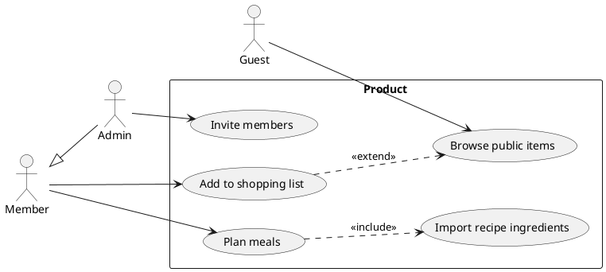
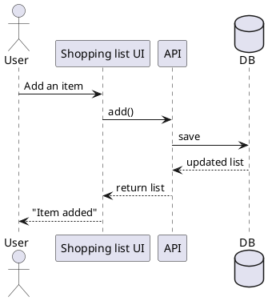
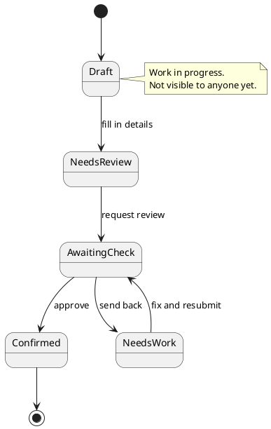
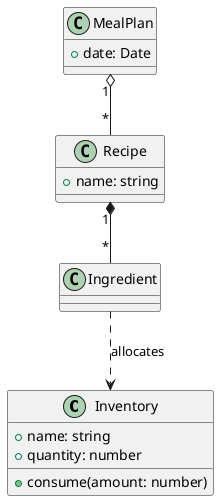
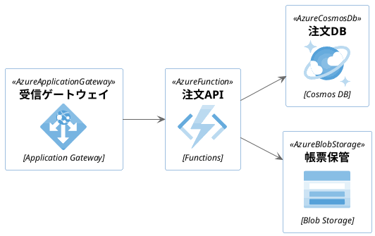

# PlantUML Local — sample tour

Open this file and press `Ctrl+Shift+V`. Every block below renders locally — no Java, no server, no network.

## Use-case diagram (system boundary, include / extend)



## Sequence diagram



## State diagram



## Class diagram



## Azure icons (bundled sprite library, no network)



## Sprite written straight into the diagram

```plantuml
@startuml
sprite $box [8x8/16] {
FFFFFFFF
F000000F
F0FFFF0F
F0F00F0F
F0F00F0F
F0FFFF0F
F000000F
FFFFFFFF
}
rectangle "<$box>\n==inline sprite" as a
@enduml
```



## A library that is not bundled (reported, not fetched)

```plantuml
@startuml
!include <aws/AWSCommon>
Alice -> Bob
@enduml
```

## Syntax error (only this block breaks; everything else stays intact)

```plantuml
@startuml
@@@ this is not valid syntax @@@
@enduml
```

## Remote reference (rejected with an explanation)

```plantuml
@startuml
!include https://example.com/theme.puml
Alice -> Bob
@enduml
```

## Other fenced blocks are untouched

```ts
export function add(a: number, b: number): number {
  return a + b
}
```

```bash
npm run bundle && npm test
```

```json
{ "name": "plantuml-local" }
```
