# PlantUML Local — sample tour

Open the preview of this file: the preview button at the top right of the editor, or **Markdown: Open Preview** (`Ctrl+Shift+V` by default). Every block below renders locally — no Java, no server, no network.

A block is a diagram when its language is `plantuml` or `puml`. The blocks under [What the preview reports](#what-the-preview-reports) go wrong on purpose. For a PlantUML file of its own, open [sample.puml](sample.puml).

## Use-case diagram (system boundary, include / extend)

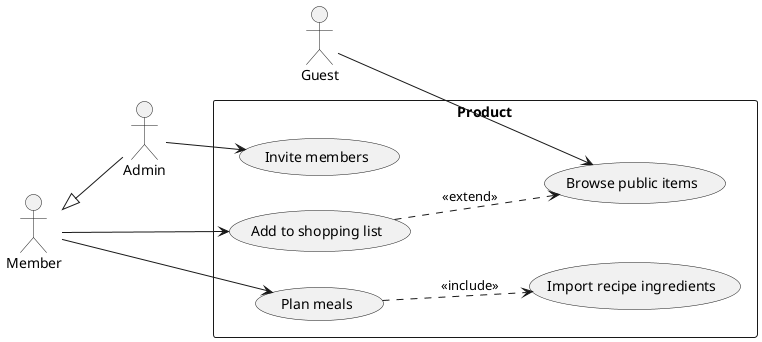
```plantuml
@startuml
left to right direction

actor "Guest" as Guest
actor "Member" as Member
actor "Admin" as Admin

Member <|-- Admin

rectangle "Product" {
  usecase "Browse public items" as View
  usecase "Add to shopping list" as AddShopping
  usecase "Plan meals" as PlanMenu
  usecase "Import recipe ingredients" as ImportRecipe
  usecase "Invite members" as Invite

  PlanMenu ..> ImportRecipe : <<include>>
  AddShopping ..> View : <<extend>>
}

Guest --> View
Member --> AddShopping
Member --> PlanMenu
Admin --> Invite
@enduml
```

## Sequence diagram (a `puml` block)

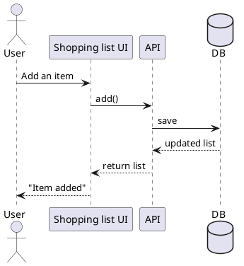
```puml
@startuml
actor User as U
participant "Shopping list UI" as P
participant "API" as A
database "DB" as D

U -> P : Add an item
P -> A : add()
A -> D : save
D --> A : updated list
A --> P : return list
P --> U : "Item added"
@enduml
```

## Activity diagram

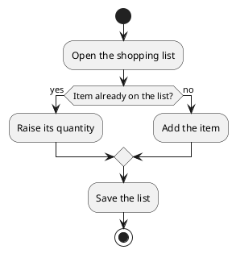
```plantuml
@startuml
start
:Open the shopping list;
if (Item already on the list?) then (yes)
  :Raise its quantity;
else (no)
  :Add the item;
endif
:Save the list;
stop
@enduml
```

## Component diagram

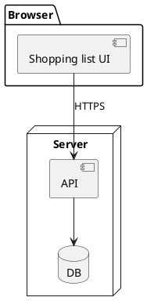
```plantuml
@startuml
package "Browser" {
  [Shopping list UI] as UI
}
node "Server" {
  [API] as API
  database "DB" as DB
}
UI --> API : HTTPS
API --> DB
@enduml
```

## State diagram

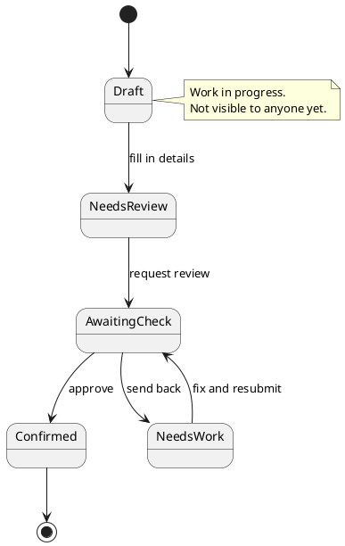
```plantuml
@startuml
[*] --> Draft

Draft --> NeedsReview : fill in details
NeedsReview --> AwaitingCheck : request review
AwaitingCheck --> Confirmed : approve
AwaitingCheck --> NeedsWork : send back
NeedsWork --> AwaitingCheck : fix and resubmit
Confirmed --> [*]

note right of Draft
  Work in progress.
  Not visible to anyone yet.
end note
@enduml
```

## Class diagram

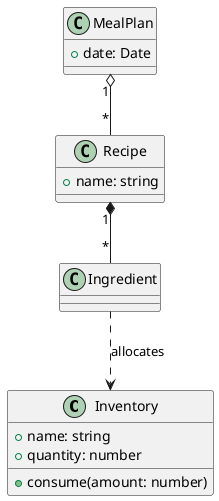
```plantuml
@startuml
class Inventory {
  +name: string
  +quantity: number
  +consume(amount: number)
}

class Recipe {
  +name: string
}

class MealPlan {
  +date: Date
}

MealPlan "1" o-- "*" Recipe
Recipe "1" *-- "*" Ingredient
Ingredient ..> Inventory : allocates
@enduml
```

## Full-width text

Japanese and other full-width characters are measured and laid out like any other text, including labels that mix them with half-width ones.

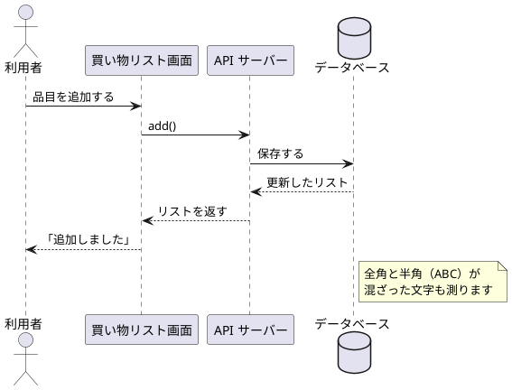
```plantuml
@startuml
actor 利用者 as U
participant "買い物リスト画面" as UI
participant "API サーバー" as A
database "データベース" as DB

U -> UI : 品目を追加する
UI -> A : add()
A -> DB : 保存する
DB --> A : 更新したリスト
A --> UI : リストを返す
UI --> U : 「追加しました」

note right of DB
  全角と半角（ABC）が
  混ざった文字も測ります
end note
@enduml
```

## Mind map, Gantt chart and JSON

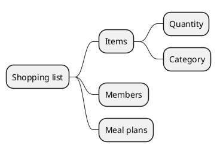
```plantuml
@startmindmap
* Shopping list
** Items
*** Quantity
*** Category
** Members
** Meal plans
@endmindmap
```

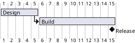
```plantuml
@startgantt
[Design] lasts 5 days
[Build] lasts 10 days
[Build] starts at [Design]'s end
[Release] happens at [Build]'s end
@endgantt
```

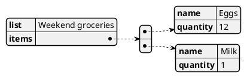
```plantuml
@startjson
{
  "list": "Weekend groceries",
  "items": [
    { "name": "Eggs", "quantity": 12 },
    { "name": "Milk", "quantity": 1 }
  ]
}
@endjson
```

## Themes and icons

`!theme` picks one of PlantUML's themes, and `<&…>` draws an OpenIconic icon. A theme made for a white page, such as `cerulean`, gets the light palette in a dark editor, so that it stays readable.

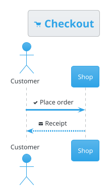
```plantuml
@startuml
!theme cerulean
title <&cart> Checkout
actor Customer
Customer -> Shop : <&check> Place order
Shop --> Customer : <&envelope-closed> Receipt
@enduml
```

## Azure icons (bundled sprite library, no network)

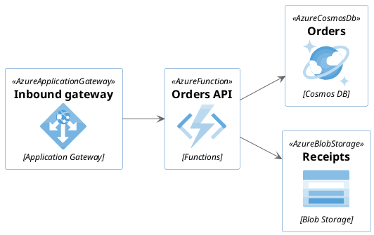
```plantuml
@startuml
!include <azure/AzureCommon>
!include <azure/Networking/AzureApplicationGateway>
!include <azure/Compute/AzureFunction>
!include <azure/Databases/AzureCosmosDb>
!include <azure/Storage/AzureBlobStorage>

LAYOUT_LEFT_RIGHT

AzureApplicationGateway(gw, "Inbound gateway", "Application Gateway")
AzureFunction(fn, "Orders API", "Functions")
AzureCosmosDb(db, "Orders", "Cosmos DB")
AzureBlobStorage(blob, "Receipts", "Blob Storage")

gw --> fn
fn --> db
fn --> blob
@enduml
```

## Sprite written straight into the diagram


```plantuml
@startuml
sprite $box [8x8/16] {
FFFFFFFF
F000000F
F0FFFF0F
F0F00F0F
F0F00F0F
F0FFFF0F
F000000F
FFFFFFFF
}
rectangle "<$box>\n==inline sprite" as a
@enduml
```

## Diagrams in block quotes and list items

> ```plantuml
> @startuml
> Alice -> Bob : Inside a block quote
> @enduml
> ```

1. A list item can hold one too:

   ```plantuml
   @startuml
   Bob -> Alice : Inside a list item
   @enduml
   ```

## Naming a block for export

The word after the language names the block. *PlantUML Local: Export All Diagrams and Update References* writes `images/checkout-flow.svg` beside this file and a reference to it below the block, for hosts such as GitHub that show PlantUML as source. On the opening line of a block without a name, the light bulb offers *Name this diagram for export…*.

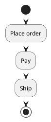
```plantuml checkout-flow
@startuml
start
:Place order;
:Pay;
:Ship;
stop
@enduml
```

## Writing a diagram

In a block, suggestions open on `@` or `!` at the start of a line, on `!theme ` and on `<&`. Outside a block, type `puml` and press `Ctrl+Space` for a whole block from one of six templates, or run *PlantUML Local: Insert Diagram Template*.

## What the preview reports

These blocks go wrong on purpose. Each gets a message in the preview, the rest of the page is unaffected, and the Problems panel lists them with their line.

### A library that is not bundled (reported, not fetched)

```plantuml
@startuml
!include <aws/AWSCommon>
Alice -> Bob
@enduml
```

### Syntax error (only this block breaks)

```plantuml
@startuml
@@@ this is not valid syntax @@@
@enduml
```

### Remote reference (rejected with an explanation)

```plantuml
@startuml
!include https://example.com/theme.puml
Alice -> Bob
@enduml
```

### No `@enduml` (drawn anyway, with a note)

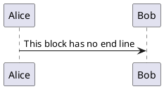
```plantuml
@startuml
Alice -> Bob : This block has no end line
```

### Two diagrams in one block (a message instead of only the first)

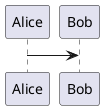
```plantuml
@startuml
Alice -> Bob
@enduml
@startuml
Bob -> Alice
@enduml
```

## Other fenced blocks are untouched

```ts
export function add(a: number, b: number): number {
  return a + b
}
```

```bash
npm run bundle && npm test
```

```json
{ "name": "plantuml-local" }
```
